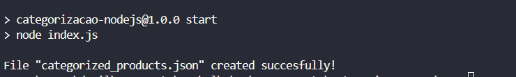
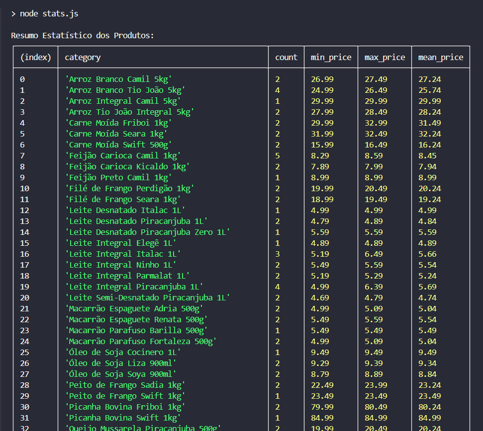

# 📌 Categorizacao NodeJS

Este projeto categoriza produtos a partir de um arquivo JSON e gera estatísticas sobre os produtos organizados por categoria.

## 🚀 Como Rodar o Projeto

### 1️⃣ Pré-requisitos
- Node.js instalado

### 2️⃣ Categorizar Produtos
Executa a categorização dos produtos e gera um arquivo `categorized_products.json`.
```sh
npm run start 
```



### 3️⃣ Gerar Estatísticas
Analisa o arquivo `categorized_products.json` e exibe um resumo estatístico.
```sh
npm run stats
```



---
Este projeto foi desenvolvido por **Danillo de Souza**.  
